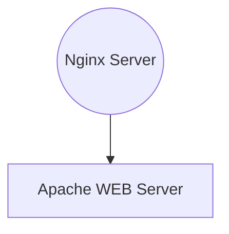

# Actividad integradora de Docker

### Alumno: Christian Acevedo

Para esta actividad creé un docker compose con 2 contenedores, un Nginx y un Apache que contiene una aplicación web compilada que tenia de un emprendimiento viejo, tiene una network para que comunique ambos contenedores y crea un volumen para alojar el **`nginx.conf`** que expone el apache en el puerto 80 y tiene configurado un endpoint
#

##  Arquitectura


#

## Imput 

una vez levantado el docker compose, se puede hacer un **`CURL localhost/healthCheck`**. esto debe devolver un json con el estado de la aplicación, deberá verse de la siguiente forma

```sh
{
    "status": "OK",
    "message": "Trabajo Integrador Docker"
}
```

